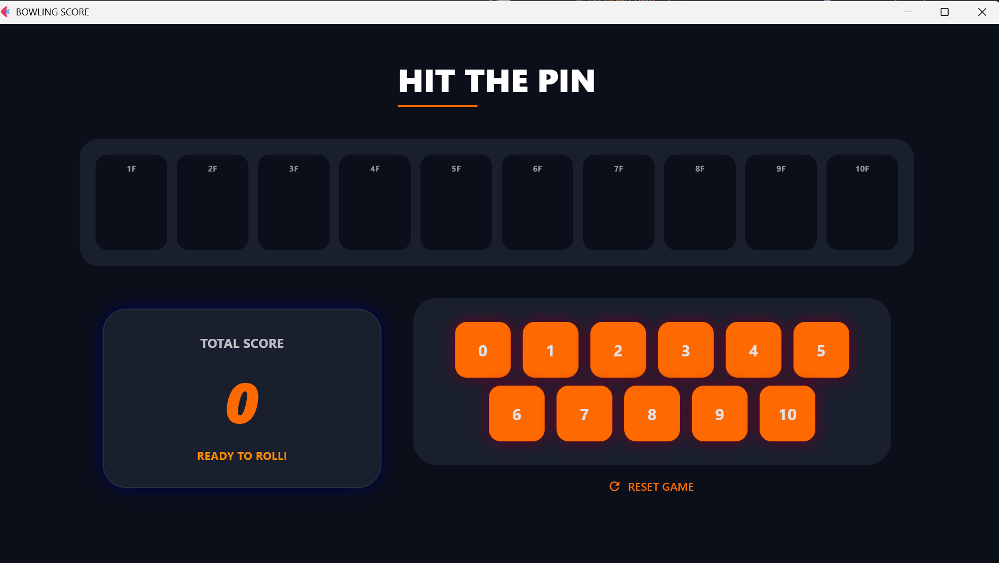
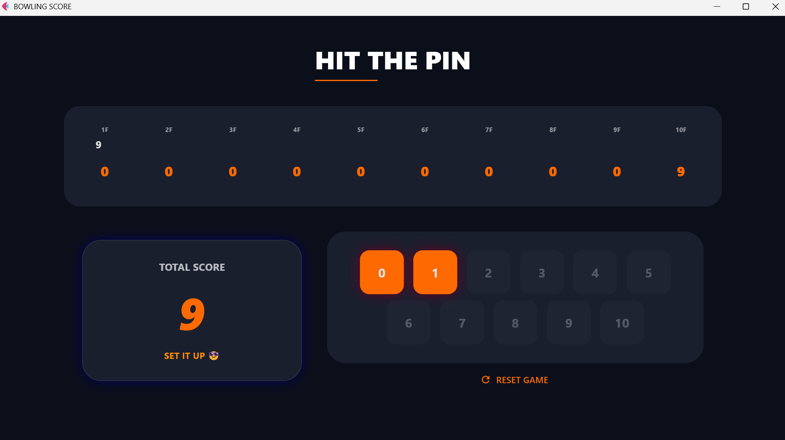
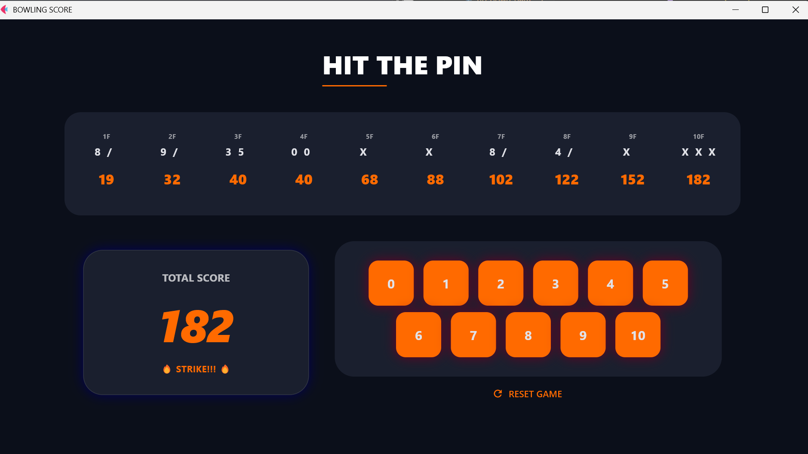

# 🎳 HIT THE PIN - Bowling Score Calculator
 
Flet으로 만든 정식 보링 점수 계산 애플리케이션입니다. Strike, Spare 등 정식 보링 규칙을 완벽히 지원합니다.
 
## 🎮 스크린샷
 
| 게임 시작 | 경기 중 |
|---|---|
|  |  |
 
| 경기 중 | PERFECT GAME |
|---|---|
|  |  |
 
## ✨ 기능
 
- **정식 보링 규칙**: Strike(X), Spare(/), 10프레임 특별 규칙 완벽 구현
- **실시간 점수 계산**: 매 롤마다 누적 점수 자동 갱신
- **프레임별 분석**: 각 프레임의 롤 결과와 누적 점수 표시
- **동적 버튼**: 현재 프레임에서 가능한 점수만 활성화
- **상태 메시지**: 
  - "ROLL IT" - 첫 번째 롤 준비
  - "SET IT UP" - 두 번째 롤 준비
  - "🔥 STRIKE!!!" - 스트라이크 달성
- **게임 리셋**: 새 게임 시작 기능
## 🎯 보링 규칙
 
### Strike (X)
- 첫 번째 롤에서 10개 핀 모두 쓰러뜨림
- 보너스: 다음 두 롤의 합
### Spare (/)
- 두 롤로 10개 핀을 모두 쓰러뜨림
- 보너스: 다음 롤 점수
### 10프레임
- 스트라이크 또는 스페어 달성 시 추가 롤 제공
- 최대 3롤 가능
### 만점
- 모든 프레임에서 스트라이크 달성
- 총 300점
## 🛠️ 설치 및 실행
 
### 설치
```bash
pip install flet
```
 
### 실행
```bash
python bowling_score.py
```
 
## 📁 파일 구조
 
```
bowling_score/
├── README.md
├── bowling_score.py
└── images/
    ├── home.png
    ├── no1.png
    ├── no2.png
    └── no3.png
```
 
## 🎮 사용 방법
 
1. **게임 시작**
   - 첫 번째 롤: 0~10 중 선택
   - 스트라이크(10) 달성 시 다음 프레임으로 자동 이동
2. **일반 롤**
   - 첫 번째 롤에서 10 미만 선택
   - 두 번째 롤: 남은 핀 개수만큼 선택 가능
   - 합이 10이면 "/"로 표시 (스페어)
3. **점수 확인**
   - 상단: 프레임별 롤 결과 (X, /, 숫자)
   - 상단 아래: 누적 점수
   - 좌측: 현재 총점
4. **게임 완료**
   - 10프레임 완료 시 최종 점수 표시
   - "RESET GAME" 버튼으로 새 게임 시작
