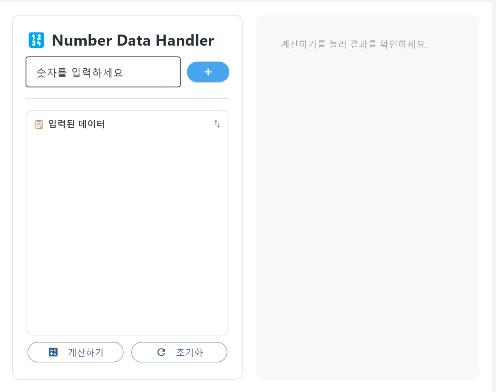
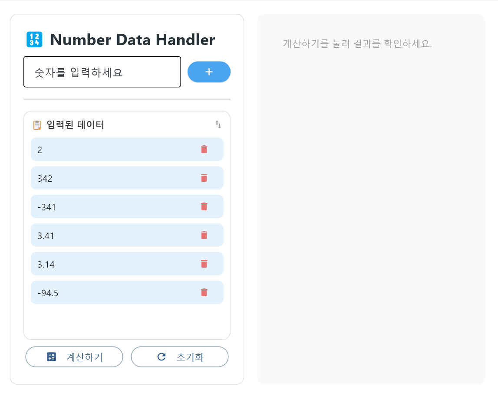
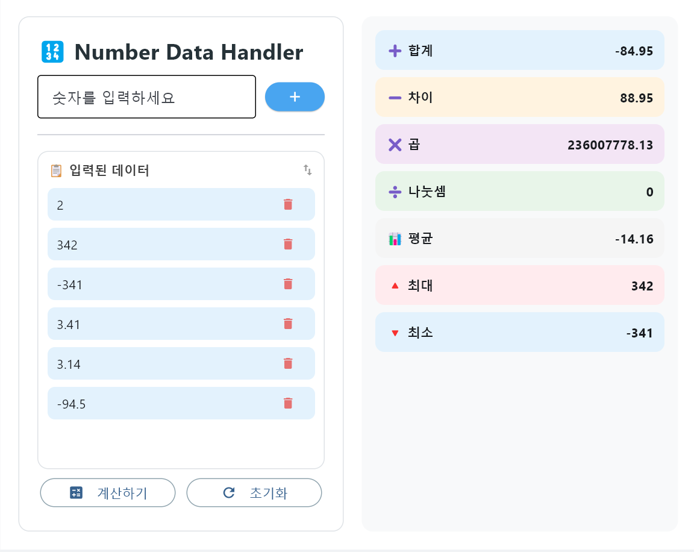

# 🔢 Number Data Handler
 
Flet으로 만든 숫자 데이터 처리 및 통계 계산 애플리케이션입니다. 여러 숫자를 입력하고 즉시 7가지 통계를 계산합니다.
 
## 🎮 스크린샷
 
| 홈 화면 | 데이터 입력 | 계산 결과 |
|---|---|---|
|  |  |  |
 
## ✨ 기능
 
- **숫자 입력**: 정수 또는 소수 입력 가능
- **데이터 관리**: 입력한 숫자 리스트 표시 및 개별 삭제
- **7가지 계산**:
  - ➕ **합계**: 모든 숫자의 합
  - ➖ **차이**: 첫 번째 수에서 나머지를 뺀 값
  - ✖️ **곱**: 모든 숫자의 곱
  - ➗ **나눗셈**: 첫 번째 수를 나머지로 나눔 (0으로 나누는 경우 제외)
  - 📊 **평균**: 입력된 숫자의 평균값
  - 🔺 **최대**: 가장 큰 숫자
  - 🔻 **최소**: 가장 작은 숫자
- **에러 처리**: 숫자가 아닌 데이터 자동 분류 및 경고
## 🛠️ 설치 및 실행
 
### 설치
```bash
pip install flet
```
 
### 실행
```bash
python flet_calculator_class.py
```
 
## 📁 파일 구조
 
```
number_data_handler/
├── README.md
├── flet_calculator_class.py
└── images/
    ├── home.png
    ├── input.png
    └── output.png
```
 
## 🎮 사용 방법
 
1. **숫자 입력**
   - "숫자를 입력하세요" 필드에 숫자 입력
   - Enter 키 또는 "+" 버튼으로 추가
2. **데이터 관리**
   - 입력된 숫자는 좌측 리스트에 표시
   - 각 항목의 휴지통 아이콘으로 삭제 가능
3. **결과 계산**
   - "계산하기" 버튼 클릭
   - 우측에 7가지 통계 즉시 표시
4. **초기화**
   - "초기화" 버튼으로 모든 데이터 및 결과 삭제
