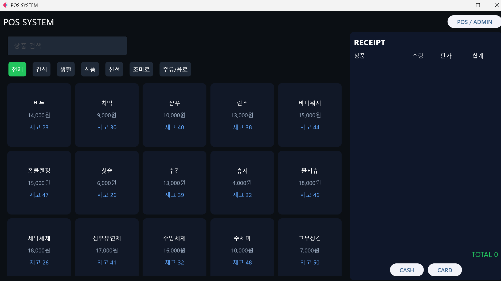
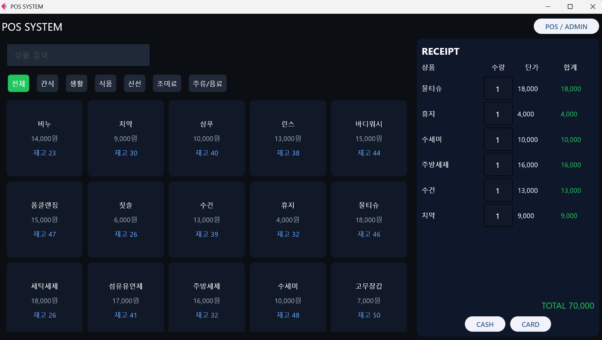
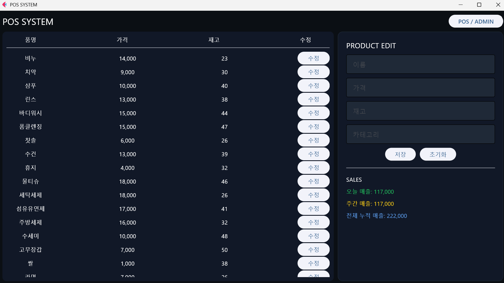
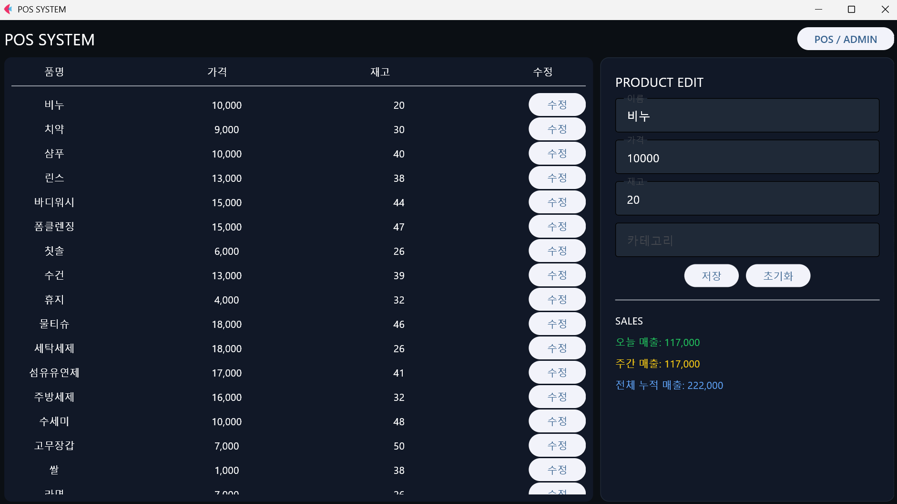

# POS SYSTEM 💳
 
Flet으로 만든 편의점 판매 시스템.<br> POS 모드에서 상품 판매, ADMIN 모드에서 상품 및 매출 관리합니다.
 
## 🎮 스크린샷
 
| POS - 상품 조회 | POS - 장바구니 |
|---|---|
|  |  |
 
| ADMIN - 수정 전 | ADMIN - 수정 후 |
|---|---|
|  |  |
 
## ✨ 기능
 
### POS 모드 (판매)
- **상품 검색**: 상품명으로 빠른 검색
- **카테고리 필터**: 카테고리별 상품 조회
- **장바구니**: 상품 추가, 수량 조정
- **결제**: 현금/카드 결제 처리
- **영수증**: 실시간 총액 계산
### ADMIN 모드 (관리)
- **상품 관리**: 상품명, 가격, 재고, 카테고리 수정
- **매출 통계**: 
  - 일일 매출
  - 주간 매출 (7일)
  - 전체 누적 매출
## 🛠️ 설치 및 실행
 
### 설치
```bash
pip install flet
```
 
### 실행
```bash
python flet_매대계산기.py
```
 
**첫 실행**: DB가 자동 생성됩니다 (mart.db)
 
## 📁 파일 구조
 
```
pos_system/
├── README.md
├── flet_매대계산기.py
├── mart.db (첫 실행 시 자동 생성)
└── images/
    ├── home.png
    ├── pos.png
    ├── admin_before.png
    └── admin_after.png
```
 
## 💾 데이터베이스
 
**자동 생성되는 테이블:**
### products 테이블
```
name (텍스트, 기본키)
price (정수)
stock (정수)
category (텍스트)
```
 
### sales 테이블
```
id (자동 증가)
amount (판매액)
date (날짜시간)
method (결제 방식: CARD/CASH)
```
 
**초기 데이터**: 없음 (ADMIN 모드에서 직접 추가)
 
## 🎮 사용 방법
 
### POS 모드 (판매)
1. 좌측에서 상품 검색 또는 카테고리 선택
2. 상품 클릭하여 장바구니에 추가
3. 우측 영수증에서 수량 조정
4. CASH/CARD 버튼으로 결제
5. 자동으로 판매 기록 저장
   
### ADMIN 모드 (관리)
1. 좌측에서 기존 상품 확인
2. 우측 입력창에 정보 입력
3. 저장 버튼으로 상품 추가/수정
4. 매출 통계 실시간 확인

 
