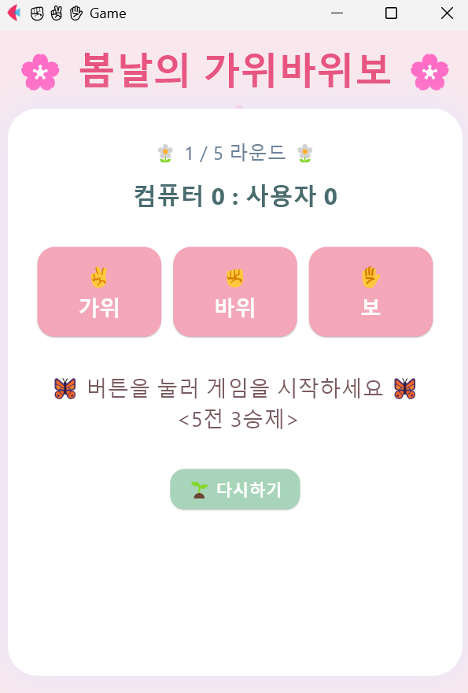
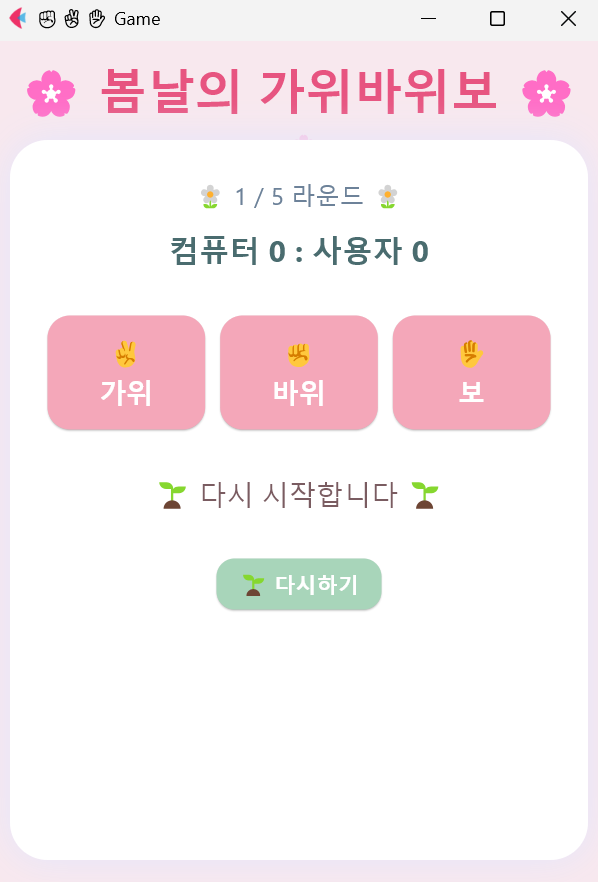
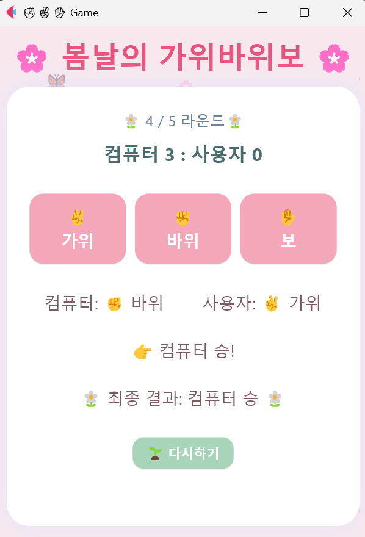
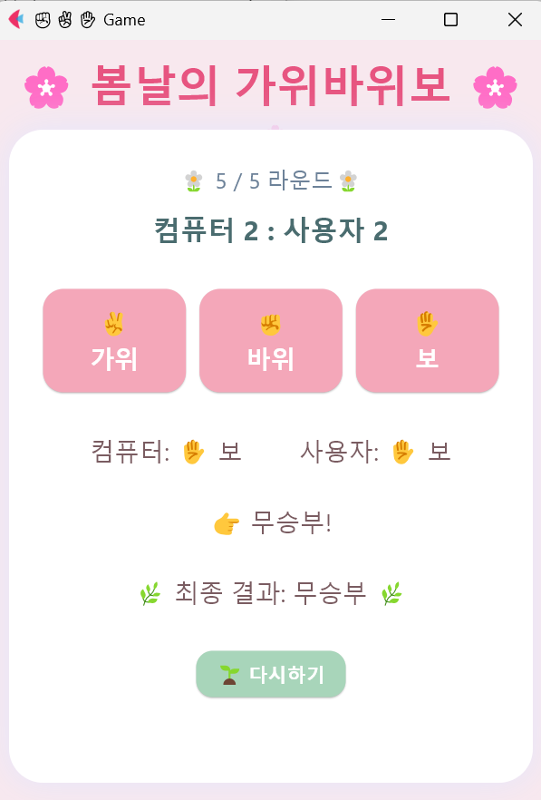
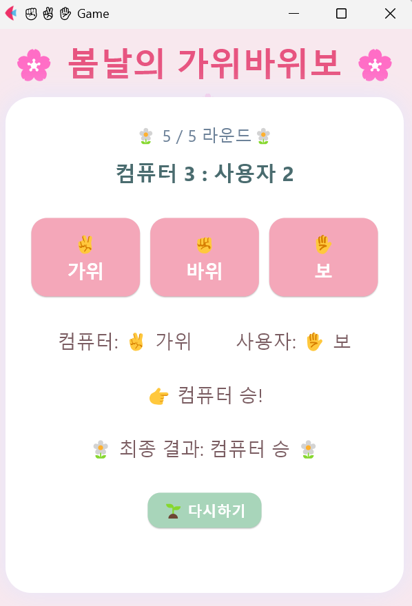
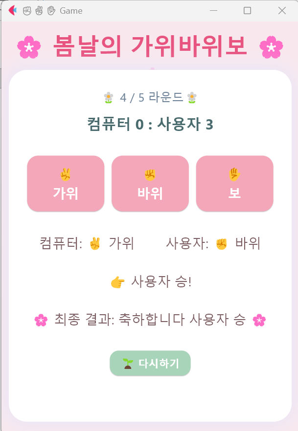

# 🌸 봄날의 가위바위보 🌸
 
Flet으로 만든 5전 3승제 가위바위보 게임. 봄 테마의 벚꽃 디자인과 함께 컴퓨터와 경쟁합니다.
 
## 🎮 스크린샷
 
| 홈 | 재시작 | 라운드 진행 | 무승부 |
|---|---|---|---|
|  |  |  |  |
 
| 컴퓨터 승리 | 사용자 승리 |
|---|---|
|  |  |
 
## 🎯 게임 규칙
 
- **방식**: 5전 3승제 (먼저 3승을 하는 쪽이 우승)
- **조건**: 최대 5라운드 진행
- **무승부**: 점수가 같으면 최종 무승부
## ✨ 기능
 
- **게임 진행**: 가위, 바위, 보 선택하여 플레이
- **점수 추적**: 현재 라운드와 누적 점수 표시
- **실시간 결과**: 각 라운드 결과 즉시 표시
- **최종 판정**: 3승 달성 또는 5라운드 완료 시 최종 우승자 결정
- **게임 리셋**: 다시하기 버튼으로 새 게임 시작
## 🛠️ 실행 방법
 
### 설치
```bash
pip install flet
```
 
### 실행
```bash
python rock_paper_scissors.py
```
 
## 📁 구조
 
```
spring_game/
├── README.md
├── rock_paper_scissors.py
└── images/
    ├── home.png
    ├── restart.png
    ├── round4.png
    ├── tie.png
    ├── comwin.png
    └── userwin.png
```
## 📝 게임 진행 예시
 
1. **1라운드**: 사용자 가위 vs 컴퓨터 보 → 사용자 승 (1:0)
2. **2라운드**: 사용자 보 vs 컴퓨터 바위 → 컴퓨터 승 (1:1)
3. **계속 진행...** 
4. **최종**: 사용자 3승 달성 → 🌸 사용자 최종 우승!
---
 
