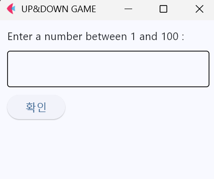
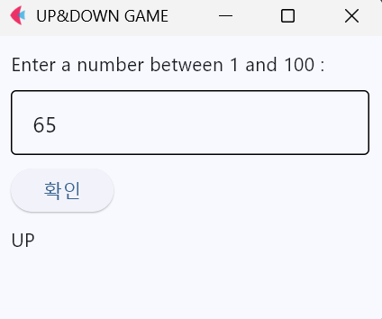
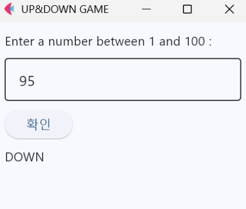
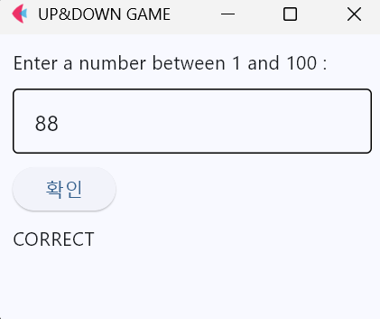

# UP&DOWN GAME 🎮
 
간단한 숫자 맞추기 게임. 컴퓨터가 1~100 사이의 난수를 정한 후, 플레이어의 입력값과 비교하여 UP/DOWN 피드백을 제공합니다.
## 🎮 게임 스크린샷
 
| 초기 화면 | UP | DOWN | CORRECT |
|---|---|---|---|
|  |  |  |  |
 

## 🎯 게임 방식
 
1. 프로그램 실행 시 컴퓨터가 1~100 사이의 난수를 선택
2. 플레이어가 1~100 사이의 정수를 입력
3. "확인" 버튼을 클릭하여 검사
4. 피드백 메시지:
   - **UP**: 입력한 숫자가 정답보다 작음
   - **DOWN**: 입력한 숫자가 정답보다 큼
   - **CORRECT**: 정답 맞춤!
## 🛠️ 설치 및 실행
 
### 요구사항
```bash
python >= 3.8
flet >= 0.20
```
 
### 설치
```bash
# pip를 통한 Flet 설치
pip install flet
 
# 또는 uv 사용
uv sync
```
 
### 실행
```bash
# 기본 실행
python main.py
 
# uv 환경에서 실행
uv run python main.py
 
# 또는 flet 직접 실행
flet run main.py
```

## 📁 파일 구조

```
up_down_game/
├── README.md
├── up_down_game.py
└── images/
    ├── updowngame.png
    ├── updown_up.png
    ├── updown_down.png
    └── updown_correct.png
```
